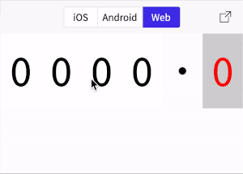

# react-native-number-ticker-input
A numeric input in the style of a ticker, which supports [Android](https://developer.android.com/), [iOS](https://developer.apple.com/) and [Web](https://github.com/necolas/react-native-web).

<a href="#badge">
  
</a>

<p align="center">
  
</p>

## Getting Started

Using [`npm`]():

```bash
npm install --save react-native-number-ticker-input
```

Using [`yarn`]():

```bash
yarn add react-native-number-ticker-input
```

## Usage

The component works very similarly to a [`<TextInput/>`](https://reactnative.dev/docs/textinput), since it is after all, just an animated wrapper of one!

```javascript
import React, { useState } from "react";
import NumberTickerInput from "react-native-number-ticker-input";

export default () => {
  const [value, setValue] = useState(0);
  return (
    <NumberTickerInput
      height={100}
      significantContainerStyle={{
        backgroundColor: 'white',
      }}
      decimalContainerStyle={{
        backgroundColor: 'lightgrey',
      }}
      significantTickerStyle={{
        fontSize: 60,
        fontFamily: 'monospace',
      }}
      decimalTickerStyle={{
        fontSize: 60,
        fontFamily: 'monospace',
        color: 'red',
      }}
      decimalDigits={1}
      value={value}
      onChange={setValue}
    />
  );
};
```

## Props

Property | Type | Required | Default value | Description
:--- | :--- | :--- | :--- | :---
height|number|no|100| Defines the component height.
value|number|no|0| Defines the current value.
onChange|func|no|() => null| Callback to update the value.
significantDigits|number|no|4| The number of digits to show before the decimal point.
significantContainerStyle|style|no|undefined| The style of the outer container for a significant digit.
significantTickerStyle|style|no|undefined| The style of an individual number ticker for a significant digit.
decimalDigits|number|no|2| The number of decimal digits.
decimalContainerStyle|style|no|undefined| The style of the outer container for a decimal digit.
decimalTickerStyle|style|no|undefined| The style of an individual number ticker for a decimal digit.
DecimalPoint|elementType|no|DecimalPoint|The component to use when rendering the decimal point. This will not be rendered if decimalDigits === 0.

## License
[MIT](https://opensource.org/licenses/MIT)
